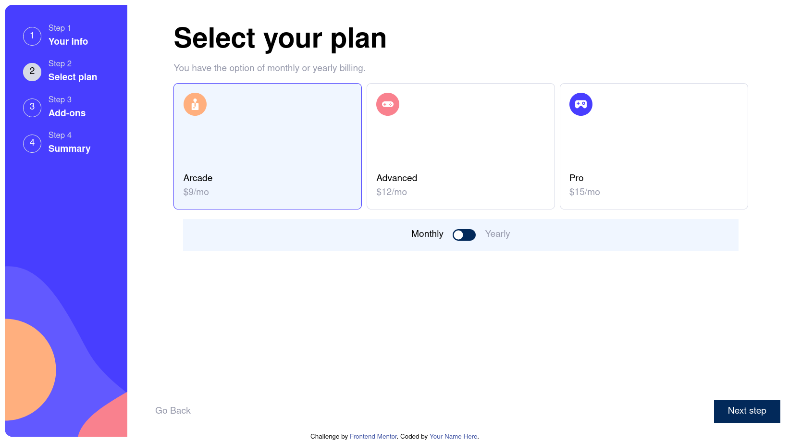

# Frontend Mentor - Multi-step form solution

This is a solution to the [Multi-step form challenge on Frontend Mentor](https://www.frontendmentor.io/challenges/multistep-form-YVAnSdqQBJ). Frontend Mentor challenges help you improve your coding skills by building realistic projects. 

## Table of contents

- [Overview](#overview)
  - [The challenge](#the-challenge)
  - [Screenshot](#screenshot)
  - [Links](#links)
- [My process](#my-process)
  - [Built with](#built-with)
  - [What I learned](#what-i-learned)
  - [Continued development](#continued-development)
  - [Useful resources](#useful-resources)
- [Author](#author)
- [Acknowledgments](#acknowledgments)

## Overview

### The challenge

Users should be able to:

- Complete each step of the sequence
- See a summary of their selections on the final step and confirm their order
- View the optimal layout for the interface depending on their device's screen size
- See hover and focus states for all interactive elements on the page

### Screenshot



### Links

- [Live Site URL](https://fem-multi-step-form.vercel.app/)
- [Solution URL](https://www.frontendmentor.io/solutions/multistep-form-HNa63nuUq_)

### Built with

- Semantic HTML5 markup
- CSS custom properties
- Flexbox
- CSS Grid
- Mobile-first workflow
- Svg
- [React](https://reactjs.org/)
- [Tailwind](https://tailwindcss.com/)


### What I learned

Using tailwind-css


using svg + react + tailwind to make a toggle
```jsx
<svg onClick={props.toggle} className="cursor-pointer w-10 h-5">
 <rect   className="fill-marine-blue" width="100%" height="100%" fill="black" rx="25%" ry="50%"/>
 <circle className="transition-all ease-in-out duration-300 fill-white" cx={props.checked ? "75%" : "25%"} cy="50%" r="25%" fill="white" />
</svg> 
```
### Continued development

Get the review and make a better solution

### Useful resources

- [Mobile First - PWA](https://developer.mozilla.org/en-US/docs/Web/Progressive_web_apps/Responsive/Mobile_first) - MDN article on implementing layout using mobile first
- [Adam Wathan - Tailwind CSS Best Practice Patterns](https://www.youtube.com/watch?v=J_7_mnFSLDg)

## Author

- Frontend Mentor - [@yourusername](https://www.frontendmentor.io/profile/ruchdane)

## Acknowledgments
